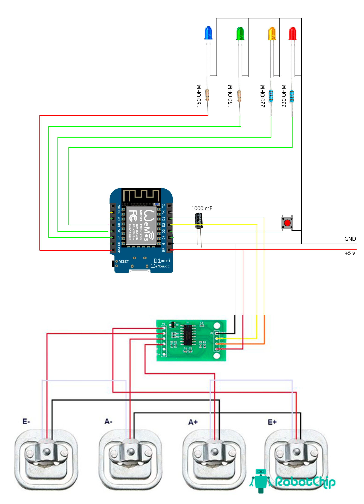

# Smart Scales (ESP8266 + HX711)

Проект умных весов для контроля соли в баке.

Устройство:
- измеряет массу через HX711;
- считает чистый вес соли (с учетом тары);
- показывает статус по порогам (норма / средний / мало);
- управляет тремя светодиодами;
- поднимает веб-интерфейс для мониторинга и настройки;
- поддерживает OTA-обновление прошивки через `/update` с логином и паролем.

## Возможности

- Два режима запуска:
  - Режим настройки (AP): точка доступа `Scales_Setup`.
  - Рабочий режим (STA): подключение к домашнему Wi-Fi.
- Хранение настроек в EEPROM:
  - Wi-Fi, калибровка, пороги, тара, максимальный вес соли, OTA-учетка.
- Быстрая сервисная калибровка в 2 шага через веб-страницу.
- Живой мониторинг в браузере с обновлением каждые 2 сек через `/api/status`.
- Индикация качества Wi-Fi (dBm и %).
- Защищенный OTA:
  - страница `/update` доступна только при заданных логине и пароле.

## Железо

### Плата

- ESP8266 (например NodeMCU / Wemos D1 mini)
- HX711 + тензодатчик

### Пины

- Кнопка: `D3`
- Зеленый LED: `D7`
- Желтый LED: `D6`
- Красный LED: `D5`
- HX711 DT: `D1`
- HX711 SCK: `D2`

## Логика индикации

По `global_net` (чистый вес соли):

- Зеленый: `weight > threshold_high` (НОРМА)
- Желтый: `threshold_low < weight <= threshold_high` (СРЕДНИЙ)
- Красный: `weight <= threshold_low` (МАЛО СОЛИ)

Если датчик недоступен > 2.5 сек, все LED мигают (ошибка датчика).

## Режимы запуска

После старта есть окно 5 секунд:

- Если нажать кнопку: включается **режим настройки** (AP `Scales_Setup`).
- Если не нажимать: включается **рабочий режим** (подключение к сохраненному Wi-Fi).

## Веб-интерфейс

### Главная страница `/`

- В режиме AP: форма полной конфигурации.
- В режиме STA: мониторинг веса, процента заполнения, статуса и Wi-Fi.

### API `/api/status`

Возвращает JSON:

- `raw`
- `gross`
- `net`
- `percent`
- `threshold_low`
- `threshold_high`
- `tare_weight`
- `max_salt`
- `calibration`
- `raw_platform`
- `wifi_rssi`
- `wifi_pct`

### Сохранение `/save` (POST)

Параметры:
- `ssid`, `pass`
- `ota_u`, `ota_p` (только в AP режиме)
- `max_salt`, `tare`, `high`, `low`

После сохранения:
- при изменении Wi-Fi/безопасности или в AP-режиме выполняется перезагрузка;
- иначе параметры применяются «на лету».

### Калибровка

- `POST /cal_step1`:
  - фиксирует `raw_step1` и введенный текущий полный физический вес.
- `POST /cal_step2`:
  - после установки контрольного груза пересчитывает:
    - `calibration`
    - `raw_platform` (абсолютный ноль платформы)
- `GET /cal_reset`:
  - сброс промежуточного шага.

## OTA-обновление

Страница обновления: `/update`

Требования доступа:
- в EEPROM должны быть заданы `otaUser` и `otaPass`;
- используется HTTP Basic Auth.

Если логин/пароль не заданы, `/update` возвращает `403`.

## Быстрый старт

1. Прошейте скетч в ESP8266.
2. На старте удержите кнопку в течение первых 5 секунд, чтобы войти в AP-режим.
3. Подключитесь к сети `Scales_Setup`.
4. Откройте `192.168.4.1` и задайте Wi-Fi, пороги, тару, `max_salt`.
5. Пройдите калибровку в 2 шага.
6. Укажите `ota_u` и `ota_p` для защищенного OTA.

## Установка и прошивка

### 1. Подготовка Arduino IDE

Установите:
- Core для ESP8266
- Библиотеки:
  - `ESP8266WiFi`
  - `ESP8266WebServer`
  - `EEPROM`
  - `ESP8266HTTPUpdateServer`
  - `HX711`

### 2. Сборка и загрузка

1. Откройте файл `smart_scales.ino`.
2. Выберите плату ESP8266 и COM-порт.
3. Загрузите прошивку.
4. Откройте Serial Monitor (115200) для диагностики старта.

## Первый запуск и настройка

1. Включите устройство.
2. В течение 5 секунд нажмите кнопку для входа в AP-режим.
3. Подключитесь к Wi-Fi сети `Scales_Setup`.
4. Откройте страницу устройства (обычно `192.168.4.1`).
5. Выполните калибровку (2 шага).
6. Заполните Wi-Fi, пороги, тару, max_salt.
7. Обязательно задайте `ota_u` и `ota_p` для безопасного OTA.
8. Сохраните настройки, дождитесь перезагрузки.

## Кнопка на устройстве

Удержание кнопки более 5 секунд в рабочем режиме:
- выполняет ручное тарирование (`tare_weight = global_gross`),
- сохраняет значение в EEPROM,
- подтверждается коротким миганием красного LED.

## Значения по умолчанию (при чистой EEPROM)

- `calibration = 25.3788`
- `raw_platform = -251644`
- `threshold_high = 15000`
- `threshold_low = 3000`
- `tare_weight = 97000`
- `max_salt = 45000`
- `otaUser = ""`
- `otaPass = ""`
- `magic = 0xABCD1255`

## Структура проекта

- `smart_scales.ino` — основной скетч
- `README.md` — документация

## Примечания по надежности

- Чтение HX711 делается вручную с отключением прерываний для более стабильного raw.
- Из нескольких измерений берется медиана (9 выборок, минимум 5 валидных).
- Процент заполнения ограничен диапазоном 0..100.

## Идеи для развития

- Добавить mDNS (`http://smart-scales.local`).
- Отправка телеметрии в MQTT/Home Assistant.
- История веса и график во встроенном UI.
- Авторизация и для основных настроек (не только OTA).

## Схема

